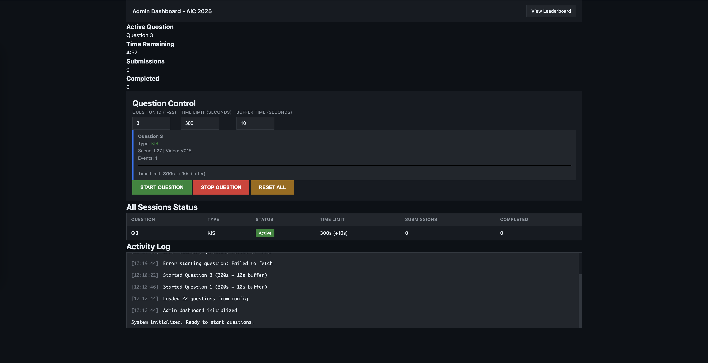
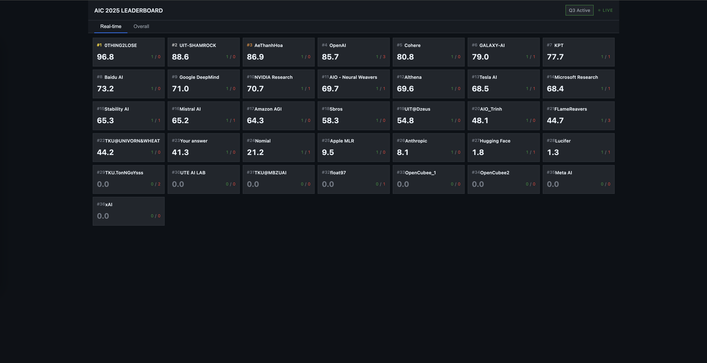
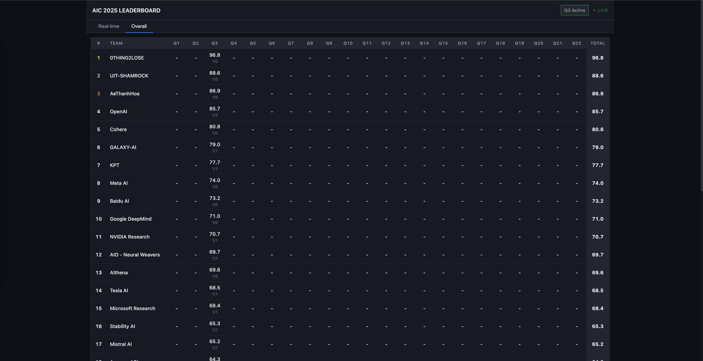

# AIC 2025 – Scoring Server

Minimal rundown for getting the mock scoring service online, feeding it data, and calling the APIs.

---

## 1. Setup & Exposure

```bash
python3 -m venv venv
source venv/bin/activate        # or venv\Scripts\activate on Windows
pip install -r requirements.txt

# Run FastAPI + auto-reload, expose to LAN on port 8000
uvicorn app.main:app --host 0.0.0.0 --port 8000 --reload
```

- `--host 0.0.0.0` allows any machine on the same network to call the service: `http://<your-LAN-ip>:8000`.
- Ensure the OS firewall (or cloud security group) allows inbound TCP 8000.
- Web apps once running:
  - Leaderboard UI: `http://<host>:8000/leaderboard-ui`
  - Admin dashboard: `http://<host>:8000/admin-dashboard`
- Register every real team via API before submitting:
  ```bash
  curl -X POST http://<host>:8000/teams/register \
    -H "Content-Type: application/json" \
    -d '{"team_name": "Your Awesome Team"}'
  # => keep the returned team_session_id secret
  ```

### UI preview
**Admin Dashboard**

**Leaderboard**

**Overall Ranking**

---

## 2. Data Configuration (`data/groundtruth.csv`)

Header:
```
id,type,scene_id,video_id,points,answer
```

| Field      | Description                                                                 |
|------------|-----------------------------------------------------------------------------|
| `id`       | Unique integer question ID.                                                 |
| `type`     | One of `KIS`, `QA`, `TR`.                                                   |
| `scene_id` | Scene identifier; must match submissions.                                   |
| `video_id` | Video identifier; must match submissions.                                   |
| `points`   | Comma‑separated integers; every pair `[start,end]` = one event (must be sorted and have even length). |
| `answer`   | (Optional, QA only) canonical uppercase answer string.                      |

Example rows:
```
1,KIS,K14,V026,"370000,386000",
9,QA,K17,V003,"340000,380000",MOCCHAU
11,TR,K02,V005,"9925,9975,10000,10050,10125,10175",
```

Update the CSV and restart the server (or hot-reload) to load new questions.

---

## 3. Core APIs

Base URL examples:
- Local machine: `http://localhost:8000`
- Same Network/wifi: `http://192.168.x.x:8000` (replace with your IP)

### Admin lifecycle
| Endpoint | Method | Body | Description |
|----------|--------|------|-------------|
| `/admin/start-question` | POST | `{"question_id": 1, "time_limit": 300, "buffer_time": 10}` | Start a question session. |
| `/admin/stop-question`  | POST | `{"question_id": 1}`                                       | Stop accepting submissions for that question. |
| `/admin/sessions`       | GET  | –                                                          | Inspect all sessions (status, timers, stats). |
| `/admin/reset`          | POST | –                                                          | Clear every session (testing only). |

### Public information
| Endpoint | Method | Description |
|----------|--------|-------------|
| `/`                 | GET | Health check. |
| `/config`           | GET | Current active question, scoring params, question list. |
| `/api/leaderboard-data` | GET | JSON payload used by the leaderboard UI. |
| `/leaderboard-ui`       | GET | Static leaderboard page. |
| `/admin-dashboard`      | GET | Static admin control panel. |

### Team management
| Endpoint | Method | Description |
|----------|--------|-------------|
| `/teams/register` | POST | Register a team name, receive `team_session_id` for future submissions. |

### Submission API
- Endpoint: `POST /submit`
- Body must include `teamSessionId` obtained from `/teams/register` plus `answerSets` data.

#### KIS body
```json
{
  "teamSessionId": "<session-id>",
  "answerSets": [{
    "answers": [
      { "mediaItemName": "L26_V017", "start": "4999", "end": "4999" },
      { "mediaItemName": "L26_V017", "start": "5049", "end": "5049" }
    ]
  }]
}
```

#### QA body
```json
{
  "teamSessionId": "<session-id>",
  "answerSets": [{
    "answers": [
      { "text": "QA-MOCCHAU-L17_V003-357500,362500" }
    ]
  }]
}
```

#### TR body
```json
{
  "teamSessionId": "<session-id>",
  "answerSets": [{
    "answers": [
      { "text": "TR-L26_V017-499,549,600" }
    ]
  }]
}
```

Rules of thumb:
- `mediaItemName` **must** be `<SCENE_ID>_<VIDEO_ID>` exactly as in CSV.
- For QA, the `ANSWER` segment must match the `answer` column verbatim (case- and accent-sensitive).
- Send complete start/end pairs for every event; partial coverage will be graded according to the tolerance logic.

---

## 4. Reference
- [Scoring logic](docs/scoring-logic.md)
- [System design](docs/system-design.md)

